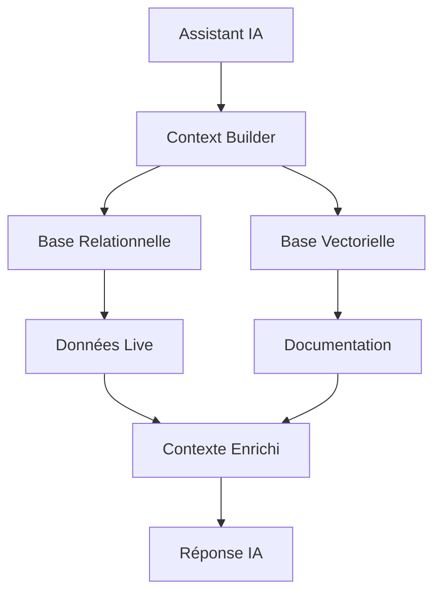

# Stratégie de Stockage pour l'Assistant IA

## 📊 Réponses à vos questions

### 1. Pourquoi les prompts n'étaient pas en base de données ?

**Raison initiale** : J'ai commencé avec localStorage pour la simplicité, mais vous avez raison - la base de données est meilleure pour :
- **Centralisation** : Tous les admins voient les mêmes prompts
- **Persistance** : Les changements survivent au vidage du cache navigateur
- **Versioning** : On peut tracker qui a modifié quoi et quand
- **Backup** : Les prompts sont sauvegardés avec les autres données

### 2. L'IA peut-elle accéder à la base de données ?

**OUI**, mais de manière **indirecte et sécurisée** :

```
User → Voice Assistant → Edge Functions → Database
```

L'assistant IA ne peut PAS :
- ❌ Faire des requêtes SQL directes
- ❌ Accéder aux données sensibles sans autorisation
- ❌ Modifier la structure de la base

L'assistant IA PEUT :
- ✅ Appeler des Edge Functions qui accèdent à la base
- ✅ Récupérer le contexte via des fonctions sécurisées
- ✅ Utiliser les outils définis dans `tools.ts`

### 3. Faut-il stocker les informations en base vectorielle ?

## 🎯 Stratégie Recommandée : Approche Hybride

### ✅ Ce qu'il faut vectoriser (base vectorielle)

1. **Documentation statique**
   - Pages de documentation
   - FAQs
   - Guides utilisateur
   - Tutoriels

2. **Contenu semi-statique**
   - Descriptions de projets
   - Wiki d'équipe
   - Templates de projets
   - Best practices

3. **Historique pertinent**
   - Résolutions de problèmes passés
   - Décisions importantes
   - Retours d'expérience

**Avantages** :
- Recherche sémantique ("comment créer un projet" trouve toutes les variantes)
- Réponses contextuelles basées sur la similarité
- Meilleure compréhension des questions ambiguës

### 📊 Ce qu'il faut garder en base relationnelle

1. **Données transactionnelles**
   - Projets actifs
   - Tâches en cours
   - Assignments d'équipe
   - Messages

2. **Données temps réel**
   - Statuts
   - Notifications
   - Métriques
   - KPIs

3. **Données structurées**
   - Profils utilisateurs
   - Permissions
   - Configurations
   - Facturations

**Avantages** :
- Données toujours à jour
- Requêtes précises et rapides
- Intégrité référentielle
- Transactions ACID

## 🚀 Architecture Proposée



### Implémentation Pratique

1. **Pour les requêtes simples** (ex: "quel est le statut du projet X?")
   → Requête directe en base relationnelle

2. **Pour les questions complexes** (ex: "comment gérer une équipe distribuée?")
   → Recherche vectorielle dans la documentation

3. **Pour le contexte complet** (ex: aide à la décision)
   → Combinaison des deux sources

## 💡 Recommandations

### Court terme (Immédiat)
1. ✅ Migrer les prompts en base de données (FAIT)
2. ✅ Utiliser les Edge Functions pour l'accès sécurisé
3. ✅ Garder les données transactionnelles en PostgreSQL

### Moyen terme (1-2 mois)
1. 🔄 Vectoriser la documentation existante
2. 🔄 Créer un système de FAQ intelligent
3. 🔄 Implémenter la recherche sémantique

### Long terme (3-6 mois)
1. 📈 RAG (Retrieval-Augmented Generation) complet
2. 📈 Apprentissage des patterns utilisateurs
3. 📈 Suggestions proactives basées sur l'historique

## 🔧 Outils Nécessaires

### Pour la vectorisation
- **pgvector** : Extension PostgreSQL (déjà dans la migration)
- **OpenAI Embeddings API** : Pour créer les vecteurs
- **Fonction de chunking** : Découper les longs documents

### Pour l'accès aux données
- **Edge Functions** : Interface sécurisée
- **RLS Policies** : Sécurité au niveau ligne
- **Context Cache** : Performance optimisée

## 📝 Exemple de Code

```typescript
// Fonction pour enrichir le contexte de l'IA
async function getAIContext(userId: string, query: string) {
  // 1. Données live de la base relationnelle
  const liveData = await supabase.rpc('get_enriched_context', {
    p_user_id: userId,
    p_context_type: detectContextType(query)
  });

  // 2. Documentation pertinente de la base vectorielle
  const embedding = await getEmbedding(query);
  const relevantDocs = await supabase.rpc('search_documentation', {
    query_embedding: embedding,
    match_threshold: 0.7
  });

  // 3. Combiner les deux
  return {
    user_context: liveData,
    relevant_documentation: relevantDocs,
    timestamp: new Date()
  };
}
```

## 🎨 Bénéfices de cette Approche

1. **Performance** : Chaque type de donnée est stocké de manière optimale
2. **Scalabilité** : Peut grandir avec vos besoins
3. **Sécurité** : Accès contrôlé via Edge Functions et RLS
4. **Intelligence** : L'IA a accès au bon contexte au bon moment
5. **Maintenabilité** : Séparation claire des responsabilités