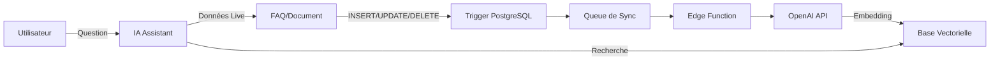

# 🔄 Stratégie de Synchronisation Base Relationnelle ↔️ Base Vectorielle

## 📌 Le Problème

Vous avez parfaitement identifié le défi :
- **FAQ** : Stockée en base relationnelle pour l'affichage sur le site
- **IA** : A besoin d'une version vectorisée pour la recherche sémantique
- **Synchronisation** : Comment garder les deux en sync automatiquement ?

## ✅ La Solution : Queue de Synchronisation Automatique

### Architecture Complète



## 🎯 Fonctionnement Détaillé

### 1. Modification de FAQ (ou autre document)

Quand vous modifiez une FAQ dans l'interface admin :

```sql
UPDATE faq_items 
SET answer = 'Nouvelle réponse améliorée'
WHERE id = '123';
```

### 2. Trigger Automatique

Le trigger PostgreSQL détecte **immédiatement** le changement :

```sql
-- Se déclenche automatiquement
CREATE TRIGGER sync_faq_embeddings
  AFTER INSERT OR UPDATE OR DELETE ON faq_items
  FOR EACH ROW
  EXECUTE FUNCTION add_to_embedding_queue();
```

### 3. Ajout à la Queue

L'item est ajouté à la queue de synchronisation :

```json
{
  "source_table": "faq_items",
  "source_id": "123",
  "action": "update",
  "content": "Question + Réponse complète",
  "status": "pending"
}
```

### 4. Traitement par Edge Function

Plusieurs options de déclenchement :

#### Option A : CRON (Recommandé)
```javascript
// Toutes les 5 minutes
await supabase.functions.invoke('process-embedding-queue', {
  body: { action: 'process', batchSize: 20 }
})
```

#### Option B : Webhook Temps Réel
```sql
-- Déclenche immédiatement après modification
CREATE TRIGGER notify_embedding_update
  AFTER INSERT ON embedding_sync_queue
  EXECUTE FUNCTION notify_edge_function();
```

#### Option C : Sur Demande
```javascript
// Après save dans l'admin
await processEmbeddingQueue()
```

### 5. Génération de l'Embedding

L'Edge Function :
1. Récupère les items "pending"
2. Appelle OpenAI pour générer l'embedding
3. Stocke dans `documentation_embeddings`
4. Marque comme "completed"

## 📊 Cas d'Usage Concrets

### FAQ Modifiée

```typescript
// 1. Admin modifie une FAQ
await updateFAQ(id, { answer: "Nouvelle réponse" })

// 2. Trigger ajoute à la queue (automatique)

// 3. Edge Function traite (dans les 5 min)
// → Génère nouvel embedding
// → Met à jour documentation_embeddings

// 4. IA utilise la version à jour
const response = await assistant.ask("Comment faire X?")
// → Trouve la FAQ mise à jour
```

### Document Client Ajouté

```typescript
// 1. Upload d'un document client
await uploadDocument(clientId, pdfFile)

// 2. Extraction du texte
const text = await extractPDFText(pdfFile)

// 3. Ajout à la queue
await addToEmbeddingQueue({
  source_table: 'client_documents',
  source_id: documentId,
  content: text
})

// 4. Traitement asynchrone
// → L'IA peut maintenant chercher dans ce document
```

### Suppression de Contenu

```typescript
// 1. Suppression d'une FAQ obsolète
await deleteFAQ(id)

// 2. Trigger détecte DELETE
// → Ajoute action: 'delete' à la queue

// 3. Edge Function supprime l'embedding
// → Plus trouvable par l'IA
```

## 🚀 Configuration Recommandée

### Développement
```javascript
// Traitement immédiat pour tests
const { data } = await supabase.functions.invoke('process-embedding-queue', {
  body: { action: 'process' }
})
```

### Production
```sql
-- pg_cron pour traitement régulier
SELECT cron.schedule(
  'process-embeddings',
  '*/5 * * * *', -- Toutes les 5 minutes
  $$
    SELECT net.http_post(
      url := 'https://[project].supabase.co/functions/v1/process-embedding-queue',
      headers := '{"Authorization": "Bearer [service_key]"}'::jsonb,
      body := '{"action": "process", "batchSize": 50}'::jsonb
    );
  $$
);
```

## 💡 Optimisations

### 1. Déduplication
La queue utilise `ON CONFLICT` pour éviter les doublons :
```sql
ON CONFLICT (source_table, source_id, action, status) 
DO UPDATE SET created_at = NOW();
```

### 2. Batch Processing
Traite plusieurs items en une fois :
```javascript
await processBatch(supabase, batchSize: 20)
```

### 3. Retry Logic
Gestion des erreurs avec compteur :
```sql
retry_count INTEGER DEFAULT 0
-- Après 3 échecs, intervention manuelle
```

### 4. Nettoyage Automatique
Supprime les anciens items traités :
```sql
DELETE FROM embedding_sync_queue
WHERE status = 'completed'
  AND processed_at < NOW() - INTERVAL '7 days';
```

## 📈 Monitoring

### Dashboard de Statut
```sql
SELECT * FROM embedding_sync_status;

-- Résultat :
-- source_table | pending | processing | completed | failed
-- faq_items    |    0    |     0      |    152    |   0
-- projects     |    2    |     1      |     89    |   1
```

### Alertes
```javascript
// Vérifier les items bloqués
const stuck = await checkStuckItems()
if (stuck.length > 0) {
  await sendAlert(`${stuck.length} items bloqués dans la queue`)
}
```

## 🔧 Maintenance

### Forcer une Resynchronisation Complète
```javascript
// Si problème de sync détecté
await supabase.functions.invoke('process-embedding-queue', {
  body: { 
    action: 'resync',
    forceResync: 'faq_items' // ou null pour tout
  }
})
```

### Vérifier la Cohérence
```sql
-- FAQs sans embedding
SELECT f.* FROM faq_items f
LEFT JOIN documentation_embeddings de 
  ON de.source_table = 'faq_items' 
  AND de.source_id = f.id::TEXT
WHERE de.id IS NULL
  AND f.is_published = true;
```

## 🎨 Avantages de cette Approche

1. **Automatique** : Pas d'intervention manuelle
2. **Fiable** : Queue garantit le traitement
3. **Scalable** : Batch processing pour volume
4. **Résilient** : Retry en cas d'échec
5. **Transparent** : Monitoring intégré
6. **Flexible** : Multiple modes de déclenchement

## 💰 Coûts OpenAI

- **text-embedding-3-small** : ~$0.02 per 1M tokens
- **Estimation** : 
  - 1000 FAQs = ~$0.50
  - 10000 documents = ~$5.00
  - Mises à jour quotidiennes négligeables

## 🚦 Checklist de Mise en Place

- [ ] Créer les tables (migration SQL)
- [ ] Déployer l'Edge Function
- [ ] Configurer OPENAI_API_KEY dans Supabase
- [ ] Activer les triggers
- [ ] Configurer le CRON (optionnel)
- [ ] Tester avec une FAQ
- [ ] Monitorer la queue
- [ ] Documenter pour l'équipe