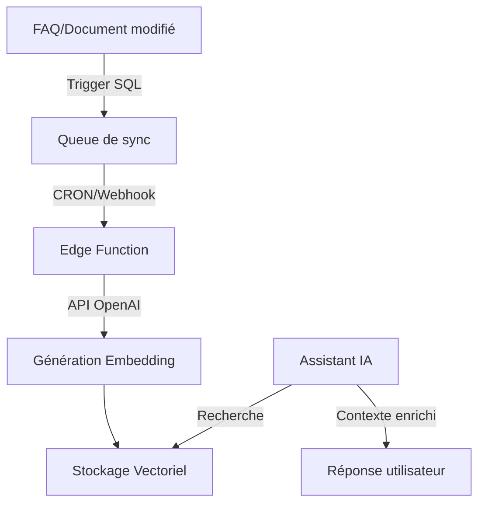

# 📊 État Actuel du Système de Base Vectorielle

## ❌ Status : NON INSTALLÉ

La base vectorielle n'est **PAS encore configurée**. J'ai préparé tout le nécessaire mais rien n'a été appliqué.

## 📝 Ce qui a été créé (mais pas appliqué)

### 1. Migrations SQL créées :
- ✅ `20250109_create_prompts_ia_table.sql` - Table pour les prompts IA
- ✅ `20250109_create_vector_storage.sql` - Tables pour stockage vectoriel
- ✅ `20250109_create_sync_system.sql` - Système de synchronisation automatique

### 2. Edge Functions créées :
- ✅ `manage-prompts-ia` - Gestion des prompts
- ✅ `process-embedding-queue` - Traitement de la queue de synchronisation
- ✅ `setup-vector-system` - Vérification et setup

### 3. Documentation créée :
- ✅ `AI_STORAGE_STRATEGY.md` - Stratégie complète
- ✅ `SYNC_VECTORIAL_STRATEGY.md` - Système de synchronisation

## 🚀 Pour Installer le Système Vectoriel

### Étape 1 : Activer pgvector dans Supabase

1. Aller dans le [Dashboard Supabase](https://supabase.com/dashboard/project/egdelmcijszuapcpglsy)
2. **Database** → **Extensions**
3. Rechercher **"vector"**
4. Cliquer sur **Enable**

### Étape 2 : Appliquer les migrations

```bash
# Appliquer toutes les migrations en attente
SUPABASE_ACCESS_TOKEN="sbp_b8ec67e2a4f3a7922f6cfea023b2cf81a00a7d9e" \
SUPABASE_DB_PASSWORD="Raymonde7510_2a" \
npx supabase db push --project-ref egdelmcijszuapcpglsy
```

### Étape 3 : Configurer OpenAI API Key

1. Dashboard Supabase → **Settings** → **Edge Functions**
2. Section **Secrets**
3. Ajouter : `OPENAI_API_KEY` = `votre-clé-openai`

### Étape 4 : Déployer la fonction de traitement

```bash
# Déployer la fonction de traitement des embeddings
SUPABASE_ACCESS_TOKEN="sbp_b8ec67e2a4f3a7922f6cfea023b2cf81a00a7d9e" \
SUPABASE_DB_PASSWORD="Raymonde7510_2a" \
npx supabase functions deploy process-embedding-queue --project-ref egdelmcijszuapcpglsy
```

### Étape 5 : Configurer le CRON (optionnel)

Pour un traitement automatique toutes les 5 minutes :

```sql
-- Dans SQL Editor de Supabase
SELECT cron.schedule(
  'process-embeddings',
  '*/5 * * * *',
  $$
    SELECT net.http_post(
      url := 'https://egdelmcijszuapcpglsy.supabase.co/functions/v1/process-embedding-queue',
      headers := jsonb_build_object(
        'Authorization', 'Bearer ' || current_setting('app.service_role_key')
      ),
      body := jsonb_build_object('action', 'process', 'batchSize', 20)
    );
  $$
);
```

## 🔄 Workflow une fois installé



## ✅ Checklist d'Installation

- [ ] pgvector activé dans Supabase
- [ ] Migrations appliquées
- [ ] OPENAI_API_KEY configurée
- [ ] Edge Function déployée
- [ ] Test avec une FAQ
- [ ] CRON configuré (optionnel)

## 🎯 Résumé

**Actuellement** : Tout est préparé mais rien n'est installé
**Action requise** : Suivre les 5 étapes ci-dessus
**Temps estimé** : 15-20 minutes
**Difficulté** : Simple (principalement des clics dans le dashboard)

## 💡 Pourquoi pas automatique ?

1. **pgvector** : Nécessite activation manuelle dans Supabase (sécurité)
2. **OpenAI Key** : Doit être fournie par vous (confidentialité)
3. **Migrations** : Prudence avant modifications de production

## 📊 Une fois installé, vous aurez :

- ✅ Synchronisation automatique FAQ ↔️ Embeddings
- ✅ Recherche sémantique pour l'IA
- ✅ Support multi-sources (FAQ, docs, wiki, projets)
- ✅ Queue de traitement résiliente
- ✅ Monitoring intégré