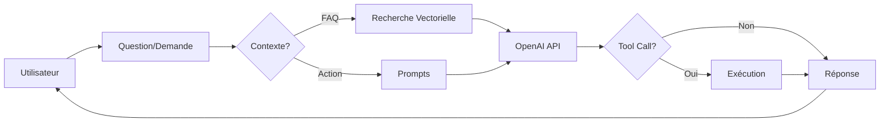

# 🤖 Documentation Système IA - Team Dash Manager

> **Date de création** : 13/09/2025
> **Version** : 2.0
> **Auteur** : Assistant Claude
> **Objectif** : Documentation technique complète pour comprendre et faire évoluer le système d'IA

## 📋 Table des matières

1. [Vue d'ensemble](#vue-densemble)
2. [Architecture générale](#architecture-générale)
3. [IA Texte (Chat)](#ia-texte-chat)
4. [IA Audio (Realtime)](#ia-audio-realtime)
5. [Base vectorielle et pgvector](#base-vectorielle-et-pgvector)
6. [Système de prompts](#système-de-prompts)
7. [Fonctions et outils](#fonctions-et-outils)
8. [Débug et maintenance](#débug-et-maintenance)

---

## 🎯 Vue d'ensemble

Team Dash Manager intègre deux systèmes d'IA complémentaires :

1. **IA Texte** : Assistant conversationnel pour créer des équipes et gérer des projets
2. **IA Audio** : Assistant vocal temps réel avec OpenAI Realtime API

Les deux systèmes partagent :
- Les mêmes prompts (table `prompts_ia`)
- Les mêmes outils (création d'équipe, planning, etc.)
- La même base de connaissances (FAQ, expertises)

---

## 🏗️ Architecture générale

```
┌─────────────────────────────────────────────┐
│            Interface Utilisateur             │
├─────────────────┬───────────────────────────┤
│   TextChatInterface  │  EnhancedVoiceAssistant │
├─────────────────┴───────────────────────────┤
│              Hooks React                     │
│  useTextChat.ts  │  useRealtimeAssistant.ts │
├──────────────────────────────────────────────┤
│           Système de Prompts                 │
│         Table: prompts_ia                    │
├──────────────────────────────────────────────┤
│           Outils & Fonctions                 │
│    project-tools.ts │ realtime-tools.ts     │
├──────────────────────────────────────────────┤
│        Base de données Supabase              │
│  - hr_profiles (métiers)                     │
│  - hr_expertises (compétences)               │
│  - hr_languages (langues)                    │
│  - faq_items (FAQ)                           │
│  - faq_embeddings (vecteurs)                 │
└──────────────────────────────────────────────┘
```

---

## 💬 IA Texte (Chat)

### Fichiers principaux

- **Hook** : `/src/ai-assistant/hooks/useTextChat.ts`
- **Interface** : `/src/components/client/TextChatInterface.tsx`
- **Configuration** : Via Edge Function `chat-completion`

### Fonctionnement

1. **Initialisation**
   ```typescript
   const { messages, sendMessage, isLoading } = useTextChat({
     context: 'création équipe',
     onToolCall: handleToolExecution
   });
   ```

2. **Pipeline de traitement**
   - Réception du message utilisateur
   - Détection du contexte (FAQ vs Action)
   - Si FAQ nécessaire → Recherche vectorielle
   - Enrichissement avec prompts de `prompts_ia`
   - Appel OpenAI via Edge Function
   - Exécution des tool calls si nécessaire

3. **Recherche FAQ intelligente**
   ```typescript
   // Détection automatique du contexte
   const needsFaqSearch = detectFaqIntent(query);
   
   // Mots-clés action → Pas de FAQ
   ['créer', 'équipe', 'budget', 'euros', ...]
   
   // Mots-clés aide → Recherche FAQ
   ['comment', 'pourquoi', 'aide', 'problème', ...]
   ```

### Configuration OpenAI

- **Modèle** : `gpt-4o`
- **Température** : 0.7
- **Max tokens** : 2000
- **Edge Function** : `chat-completion`

---

## 🎙️ IA Audio (Realtime)

### Fichiers principaux

- **Hook** : `/src/ai-assistant/hooks/useRealtimeAssistant.ts`
- **Interface** : `/src/components/client/EnhancedVoiceAssistant.tsx`
- **Configuration** : `/src/ai-assistant/config/realtime-tools.ts`

### Fonctionnement

1. **Connexion WebSocket**
   ```typescript
   // Obtention d'une clé éphémère
   const ephemeralKey = await getEphemeralKey();
   
   // Connexion WebSocket directe
   const ws = new WebSocket(
     'wss://api.openai.com/v1/realtime',
     ['openai-insecure-api-key.' + ephemeralKey]
   );
   ```

2. **Configuration de session**
   ```typescript
   {
     modalities: ['text', 'audio'],
     voice: 'echo',
     input_audio_format: 'pcm16',
     output_audio_format: 'pcm16',
     turn_detection: {
       type: 'server_vad',
       threshold: 0.3,
       silence_duration_ms: 150
     }
   }
   ```

3. **Capture audio**
   - Utilise MediaRecorder API
   - Format : PCM 16-bit, 24kHz
   - Conversion via AudioWorklet
   - Envoi en base64 via WebSocket

### États visuels

- 🔵 **Idle** : En attente
- 🟢 **Listening** : Écoute active
- 🟡 **Processing** : Traitement en cours
- 🟣 **Speaking** : Réponse vocale

---

## 🔍 Base vectorielle et pgvector

### Structure

```sql
-- Table des FAQ
CREATE TABLE faq_items (
  id UUID PRIMARY KEY,
  question TEXT,
  answer TEXT,
  category TEXT,
  is_published BOOLEAN,
  embedding_synced_at TIMESTAMP
);

-- Table des embeddings (vecteurs)
CREATE TABLE faq_embeddings (
  id UUID PRIMARY KEY,
  faq_item_id UUID REFERENCES faq_items(id),
  content TEXT,
  embedding VECTOR(1536), -- Vecteur OpenAI
  created_at TIMESTAMP
);
```

### Fonctions de recherche

1. **Recherche vectorielle** (avec pgvector)
   ```sql
   CREATE FUNCTION search_faq_embeddings(
     query_text TEXT,
     similarity_threshold FLOAT DEFAULT 0.7
   )
   -- Utilise la similarité cosinus
   -- embedding <=> query_embedding
   ```

2. **Recherche textuelle** (fallback)
   ```sql
   CREATE FUNCTION search_faq_text(
     search_query TEXT
   )
   -- Utilise la recherche full-text PostgreSQL
   -- Nettoie automatiquement les caractères spéciaux
   ```

### Synchronisation des embeddings

- **Edge Function** : `sync-faq-embeddings`
- **Déclencheur** : Mise à jour de `faq_items`
- **API** : OpenAI text-embedding-ada-002

---

## 📝 Système de prompts

### Table `prompts_ia`

```sql
CREATE TABLE prompts_ia (
  id UUID PRIMARY KEY,
  name TEXT,           -- Nom du prompt
  context TEXT,        -- Type: general, team-composition, behavior
  prompt TEXT,         -- Contenu du prompt
  active BOOLEAN,      -- Actif/Inactif
  priority INTEGER,    -- Ordre de priorité
  variables JSONB      -- Variables optionnelles
);
```

### Types de prompts

1. **System** (`context: 'general'`)
   - Instructions générales de l'assistant
   - Identité et rôle principal

2. **Context** (`context: 'team-composition'`, etc.)
   - Instructions spécifiques par domaine
   - Règles métier

3. **Behavior** (`context: 'behavior'`)
   - Ton et style de communication
   - Contraintes de réponse

### Gestion des prompts

- **Interface admin** : `/admin/assistant`
- **Chargement** : Automatique au démarrage
- **Priorité** : Ordre décroissant (100 = max)
- **RLS** : Lecture publique, écriture admin

### Exemple de prompt

```typescript
{
  name: "Assistant Général",
  context: "general",
  prompt: `Tu es l'assistant intelligent de Team Dash Manager.
           RÔLE : Aider à composer des équipes projet.
           FOCUS : Création d'équipes, pas de tutoriels techniques.`,
  active: true,
  priority: 100
}
```

---

## 🛠️ Fonctions et outils

### Outils disponibles

| Outil | Description | Paramètres |
|-------|-------------|------------|
| `create_team` | Créer une équipe projet | project_name, profiles[], budget |
| `create_meeting` | Planifier une réunion | title, date, time, participants |
| `create_todo_kanban` | Ajouter une tâche | title, column, priority |
| `create_event_calendar` | Créer un événement | title, date, type |
| `search_project` | Rechercher un projet | query |

### Structure d'un outil

```typescript
interface RealtimeTool {
  name: string;
  description: string;
  parameters: {
    type: 'object';
    properties: Record<string, any>;
    required: string[];
  };
  execute: (params: any) => Promise<any>;
}
```

### Validation des données

1. **Métiers** : Via `expertise-provider.ts`
   - Validation stricte des métiers existants
   - Mapping des expertises par métier
   - Normalisation des séniorités

2. **Langues** : Table `hr_languages`
   - 11 langues disponibles
   - Validation avant création

3. **Séniorités** : Normalisation automatique
   ```typescript
   'junior' | 'intermediate' | 'senior'
   // Mapping: expert → senior, confirmé → intermediate
   ```

### Création d'équipe

```typescript
// 1. Validation des profils
const validation = expertiseProvider.validateProfile({
  profession: 'Chef de projet',
  seniority: 'senior',
  languages: ['Français'],
  expertises: ['Agile', 'Scrum']
});

// 2. Création dans ReactFlow
const nodes = createReactFlowNodes(validatedProfiles);

// 3. Sauvegarde en base
await supabase
  .from('hr_resource_assignments')
  .insert(resourceData);
```

---

## 🐛 Débug et maintenance

### Logs importants

```javascript
// IA Texte
console.log('🎯 Contexte détecté:', needsFaqSearch);
console.log('📚 Prompts chargés:', prompts.length);

// IA Audio
console.log('🎤 État audio:', audioState);
console.log('📡 WebSocket:', ws.readyState);

// Validation
console.log('✅ Profil validé:', validation);
console.log('❌ Erreurs:', validation.errors);
```

### Edge Functions de maintenance

| Fonction | Usage |
|----------|-------|
| `check-prompts` | Vérifier les prompts actifs |
| `fix-prompts-rls` | Corriger les permissions |
| `create-faq-search-function` | Créer les fonctions SQL |
| `apply-rls-migration-direct` | Appliquer les migrations RLS |

### Commandes utiles

```bash
# Déployer une Edge Function
SUPABASE_ACCESS_TOKEN="sbp_..." \
SUPABASE_DB_PASSWORD="..." \
npx supabase functions deploy [function-name] \
  --project-ref egdelmcijszuapcpglsy

# Voir les logs
npx supabase functions logs [function-name] \
  --project-ref egdelmcijszuapcpglsy --limit 10

# Tester les prompts
node check-ia-system.mjs
```

### Points d'attention

1. **RLS (Row Level Security)**
   - Les prompts doivent être lisibles par tous
   - Policy : `allow_public_read` avec `USING (true)`

2. **Caractères spéciaux**
   - Échapper dans les requêtes SQL
   - Nettoyer avant recherche FAQ

3. **Performances**
   - Limiter les recherches FAQ (max 5 résultats)
   - Cache des expertises au chargement

4. **WebSocket Realtime**
   - Gérer les déconnexions
   - Nettoyer les listeners audio

---

## 📚 Évolutions futures

### Améliorations possibles

1. **Recherche vectorielle complète**
   - Générer les embeddings pour toutes les FAQ
   - Utiliser la similarité cosinus native pgvector
   - Cache des embeddings fréquents

2. **Multi-modalité**
   - Support des images dans le chat
   - Partage d'écran pour l'assistant vocal
   - Transcription automatique des réunions

3. **Intelligence augmentée**
   - Apprentissage des préférences utilisateur
   - Suggestions proactives d'équipes
   - Analyse prédictive des besoins projet

4. **Intégrations**
   - Export vers outils externes (Jira, Slack)
   - Import de templates d'équipes
   - Webhooks pour automatisation

---

## 🔒 Sécurité

### Points critiques

1. **Clés API**
   - Jamais exposer les clés service dans le frontend
   - Utiliser des clés éphémères pour Realtime
   - Rotation régulière des clés

2. **Validation des entrées**
   - Toujours valider côté serveur
   - Échapper les caractères spéciaux
   - Limiter la taille des requêtes

3. **RLS Supabase**
   - Activer sur toutes les tables
   - Tester les policies régulièrement
   - Logs des accès sensibles

---

## 📈 Métriques et monitoring

### KPIs à suivre

- Nombre de créations d'équipes via IA
- Taux de succès des tool calls
- Temps de réponse moyen
- Satisfaction utilisateur
- Coût API OpenAI

### Tables de logs

```sql
-- Table des actions IA
CREATE TABLE ai_action_logs (
  id UUID PRIMARY KEY,
  user_id UUID,
  action_type TEXT,
  action_data JSONB,
  result JSONB,
  status TEXT,
  created_at TIMESTAMP
);
```

---

## 🚀 Quick Start pour développeur

### 1. Comprendre le flow



### 2. Tester localement

```bash
# 1. Vérifier les prompts
node check-ia-system.mjs

# 2. Tester la création d'équipe
node test-ia-simple.mjs

# 3. Lancer le dev server
npm run dev
```

### 3. Modifier un prompt

1. Aller dans `/admin/assistant`
2. Éditer le prompt souhaité
3. Sauvegarder (actif immédiatement)

### 4. Ajouter un nouvel outil

1. Définir dans `realtime-tools.ts`
2. Implémenter la fonction dans `project-tools.ts`
3. Ajouter la validation dans `validation-helper.ts`

---

## 📞 Support et contact

- **Documentation principale** : `/llm`
- **Code source** : GitHub (après push)
- **Logs** : Dashboard Supabase
- **Monitoring** : `/admin/assistant` (onglet Logs)

---

*Cette documentation est maintenue à jour avec chaque évolution majeure du système d'IA.*